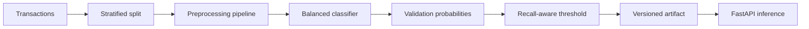

# Credit Card Fraud Detection System

[](https://github.com/aminbakhtiari777/credit-card-fraud-detection/actions/workflows/ci.yml)
[](https://www.python.org/)
[](https://fastapi.tiangolo.com/)
[](https://www.docker.com/)

An end-to-end fraud-detection portfolio project focused on the decisions that matter for highly imbalanced financial data: precision-recall trade-offs, leakage-safe threshold selection, false-alarm cost, reproducibility, and production inference.

The original learning notebook remains in the repository. The production package adds a reproducible pipeline, validation-based threshold tuning, interpretable global coefficients, a tested API, Docker packaging, and CI.

## Why accuracy is misleading

Fraud is rare. A model that predicts every transaction as legitimate can report excellent accuracy while detecting no fraud. This project therefore treats **PR-AUC and fraud recall** as primary metrics and reports false positives explicitly.

## Architecture



## Engineering features

- Strict schema validation for all 30 transaction features
- Stratified train, validation, and test splits
- Median imputation and robust scaling inside one pipeline
- Class-balanced logistic regression for a transparent baseline
- Threshold selected on validation data, never on the test set
- PR-AUC, ROC-AUC, precision, recall, F1, confusion counts, and false-positive rate
- Global feature-risk explanation from standardized coefficients
- Versioned model artifact containing model and threshold
- FastAPI health, prediction, and model-info endpoints
- Unit and API tests, Docker, and GitHub Actions

## Repository structure

```text
.
├── Fraud_Detection.ipynb       Original exploration
├── src/fraud/                  Production package
├── scripts/train.py            Reproducible training command
├── tests/                      Core and API tests
├── models/                     Generated artifacts (ignored)
├── Dockerfile
├── pyproject.toml
└── requirements.txt
```

## Quick start

```bash
python -m venv .venv
source .venv/bin/activate
pip install -r requirements-dev.txt
python scripts/train.py --data-file path/to/creditcard.csv
uvicorn fraud.api:app --app-dir src --host 0.0.0.0 --port 8000
```

Interactive API documentation is available at `http://localhost:8000/docs`.

## Prediction response

The API returns:

```json
{
  "fraud_probability": 0.873421,
  "is_fraud": true,
  "threshold": 0.64
}
```

The probability and decision are deliberately separate. Operations teams can change the threshold according to investigation capacity and the relative cost of missed fraud.

## Reproduced benchmark

The training command was executed on the full public dataset with an untouched, stratified 20% test set. The threshold was selected only from a separate validation split with a minimum-recall target of 0.80.

| Metric | Test result |
| --- | ---: |
| PR-AUC | 0.7156 |
| ROC-AUC | 0.9721 |
| Fraud recall | 0.8673 |
| Fraud precision | 0.5414 |
| F1 | 0.6667 |
| False-positive rate | 0.00127 |
| True fraud detected | 85 of 98 |
| False alarms | 72 of 56,864 legitimate transactions |

These numbers are reproducible evaluation results for this split, not guaranteed production performance.

## Training outputs

`scripts/train.py` creates:

- `models/fraud_artifact.joblib`
- `models/metrics.json`

The metrics file records the selected threshold and untouched test-set results. It also includes the features with the strongest positive and negative global coefficients.

## Tests

```bash
python -m unittest discover -s tests -v
```

## Docker

Train the artifact before building:

```bash
docker build -t fraud-detection-api .
docker run --rm -p 8000:8000 fraud-detection-api
```

## Responsible-use notes

- The model supports analyst prioritization; it must not autonomously block customers.
- False positives and false negatives have different financial and human costs.
- Probability calibration, data drift, delayed labels, and adversarial behavior require monitoring.
- The anonymized PCA features limit case-level explanations.
- Production deployment requires authentication, encrypted transport, audit logging, and access controls.

## Author

**Amin Bakhtiari** — AI/ML engineering portfolio project.
